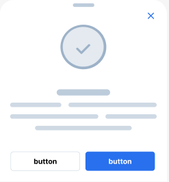

[Back](../README.md)
# Confirmation Box

The **Confirmation Box** component is a full-screen bottom modal dialog for confirming important user actions.
It features a success checkmark icon, title, description area, and dual action buttons,
designed for critical confirmations and status feedback.

It is visually identical to the original design but refactored to be:

- Responsive
- Playground-friendly
- Easy to reuse or modify
- Accessible with proper ARIA attributes

---

## Overview

- Bottom sheet style modal with white background
- Large circular success icon with checkmark
- Customizable title and description
- Two action buttons: Cancel and Confirm
- Close button in top right
- Multiple status types (success, warning, error)
- Semi-transparent backdrop overlay
- Smooth animations and transitions

This component is best suited for:
- Confirmation of critical actions
- Status feedback after user actions
- Important warnings or alerts
- Form submission confirmations
- Transaction confirmations
- Account action verifications

---

## Preview in Playground



To render the Confirmation Box component locally, import it into the playground:

```tsx
import { ConfirmationBox } from '../components'

export function Playground() {
  return (
    <ConfirmationBox
      title="Action Confirmed"
      description="Your action has been processed successfully"
      onConfirm={() => console.log('Confirmed')}
      onCancel={() => console.log('Cancelled')}
      isOpen={true}
      type="success"
    />
  )
}
```

---
## Code
```tsx
import React, { useState } from 'react';
import './Confirmation-box.css';

const imgCloseIcon = "https://www.figma.com/api/mcp/asset/4788f212-55b8-4729-ab7c-5377acbbdfe7";
const imgCheckmark = "https://www.figma.com/api/mcp/asset/ee5931ef-171d-4838-8d83-cd326857d08e";

interface ConfirmationBoxProps {
  title?: string;
  description?: string;
  onConfirm?: () => void;
  onCancel?: () => void;
  isOpen?: boolean;
  type?: 'success' | 'warning' | 'error';
}

const ConfirmationBox: React.FC<ConfirmationBoxProps> = ({
  title = "Confirm Action",
  description = "Are you sure you want to proceed?",
  onConfirm = () => {},
  onCancel = () => {},
  isOpen = true,
  type = 'success',
}) => {
  const [open, setOpen] = useState(isOpen);

  const handleCancel = () => {
    setOpen(false);
    onCancel();
  };

  const handleConfirm = () => {
    setOpen(false);
    onConfirm();
  };

  if (!open) return null;

  return (
    <div className="confirmation-overlay">
      <div className="confirmation-container" role="alertdialog" aria-modal="true">
        <button 
          className="confirmation-close" 
          onClick={handleCancel}
          aria-label="Close dialog"
        >
          
        </button>

        <div className="confirmation-header">
          <span className="confirmation-header-placeholder"></span>
        </div>

        <div className="confirmation-icon-wrapper">
          <div className={`confirmation-icon confirmation-icon-${type}`}>
            
          </div>
        </div>

        <div className="confirmation-content">
          <h2 className="confirmation-title">{title}</h2>
          <p className="confirmation-description">{description}</p>
        </div>

        <div className="confirmation-actions">
          <button 
            className="confirmation-button confirmation-button-cancel" 
            onClick={handleCancel}
          >
            Cancel
          </button>
          <button 
            className="confirmation-button confirmation-button-confirm" 
            onClick={handleConfirm}
          >
            Confirm
          </button>
        </div>
      </div>
    </div>
  );
};

export default ConfirmationBox;
```

---
## CSS
```css
/* --- Confirmation Overlay (backdrop) --- */
.confirmation-overlay {
  position: fixed;
  top: 0;
  left: 0;
  width: 100%;
  height: 100%;
  
  background-color: rgba(0, 0, 0, 0.5);
  display: flex;
  align-items: flex-end;
  justify-content: center;
  z-index: 1000;
  padding: 24px;
}

/* --- Confirmation Container --- */
.confirmation-container {
  width: 100%;
  max-width: 375px;
  
  background-color: #FFFFFF;
  border-radius: 32px 32px 0 0;
  overflow: hidden;
  
  display: flex;
  flex-direction: column;
  
  box-shadow: 0 10px 40px rgba(0, 0, 0, 0.2);
  position: relative;
  min-height: 408px;
}

/* --- Close Button --- */
.confirmation-close {
  position: absolute;
  top: 24px;
  right: 24px;
  z-index: 10;
  
  width: 24px;
  height: 24px;
  
  background: none;
  border: none;
  padding: 0;
  cursor: pointer;
  
  display: flex;
  align-items: center;
  justify-content: center;
  
  transition: opacity 0.2s ease;
}

.confirmation-close:hover {
  opacity: 0.7;
}

/* --- Confirmation Header Placeholder --- */
.confirmation-header {
  width: 100%;
  height: 24px;
  padding: 24px 24px 0 24px;
  
  display: flex;
  justify-content: center;
}

.confirmation-header-placeholder {
  width: 120px;
  height: 14px;
  background-color: #BDCCDB;
  border-radius: 10px;
}

/* --- Confirmation Icon Wrapper --- */
.confirmation-icon-wrapper {
  flex: 1;
  display: flex;
  align-items: center;
  justify-content: center;
  padding: 56px 24px 40px 24px;
}

/* --- Confirmation Icon --- */
.confirmation-icon {
  width: 103px;
  height: 100px;
  
  display: flex;
  align-items: center;
  justify-content: center;
  
  border-radius: 50%;
  border: 3px solid #9DB2C8;
  background-color: #E4EAF0;
}

.confirmation-icon-success {
  border-color: #2870ED;
  background-color: #E4EAF0;
}

.confirmation-icon-warning {
  border-color: #FF9500;
  background-color: #FFF3E0;
}

.confirmation-icon-error {
  border-color: #FF3B30;
  background-color: #FFE5E5;
}

/* --- Confirmation Actions --- */
.confirmation-actions {
  display: flex;
  gap: 12px;
  padding: 24px;
  background-color: #FFFFFF;
  border-top: 1px solid #EFEFF4;
}

/* --- Confirmation Buttons --- */
.confirmation-button {
  flex: 1;
  padding: 10.5px 10px;
  
  background: none;
  border: 1px solid #CED9E4;
  border-radius: 6px;
  
  font-family: 'Inter', sans-serif;
  font-weight: 700;
  font-size: 16px;
  line-height: 1.4;
  text-align: center;
  
  cursor: pointer;
  transition: all 0.2s ease;
}

.confirmation-button:hover {
  opacity: 0.9;
}

.confirmation-button:active {
  opacity: 0.7;
}

.confirmation-button-cancel {
  border: 1px solid #CED9E4;
  background-color: #FFFFFF;
  color: #000000;
}

.confirmation-button-cancel:hover {
  background-color: #F5F5F5;
}

.confirmation-button-confirm {
  border: none;
  background-color: #2870ED;
  color: #FFFFFF;
}

.confirmation-button-confirm:hover {
  background-color: #1e5ad4;
}
```

---

## Design Details

### Color Palette
- **Background**: #FFFFFF (White)
- **Overlay**: rgba(0, 0, 0, 0.5) (Semi-transparent black)
- **Icon Background**: #E4EAF0 (Light Grey)
- **Icon Border**: #9DB2C8 (Grey) / #2870ED (Blue for success)
- **Cancel Button**: #FFFFFF with #CED9E4 border
- **Confirm Button**: #2870ED (Bright Blue)
- **Text Placeholder**: #BDCCDB, #CED9E4 (Light Greys)

### Typography
- **Font Family**: Inter
- **Title Weight**: Semibold (600), Size: 16px
- **Button Weight**: Bold (700), Size: 16px
- **Line Height**: 1.4

### Dimensions
- **Max Width**: 375px
- **Min Height**: 408px
- **Icon Size**: 103px × 100px
- **Icon Border Radius**: 50% (circle)
- **Container Border Radius**: 32px (top only)
- **Button Padding**: 10.5px (vertical) × 10px (horizontal)

### Status Type Colors
- **Success**: Blue (#2870ED) border
- **Warning**: Orange (#FF9500) border
- **Error**: Red (#FF3B30) border

### Interactions
- Bottom sheet animation from bottom
- Hover effects on buttons
- State management for opening/closing
- Smooth transitions (0.2s ease)
- Close button to dismiss
- Responsive on mobile devices
